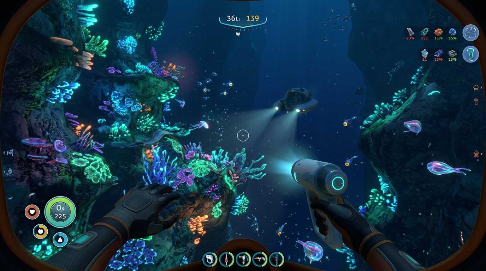

# 🌊 Subnautica VR — SubmersedVR 6DOF v1.0.0

  
  
  
  

  

---

## 🤿 Présentation

Plongez dans les profondeurs de la planète 4546B en **Réalité Virtuelle 6DOF intégrale**. Vos mains contrôlent directement le scanner, le découpeur laser, le Seaglide ainsi que les manettes de pilotage du Seamoth et du sous-marin Cyclops !

### 🌟 Fonctionnalités Clés
- **Vrais Contrôles 6DOF des Mains** : Fini la visée par la tête ! Tout se manipule avec les manettes du casque.
- **Upscaling IA OpenXR & Eaux Cristallines** : Rendu visuel sublimé sans scintillement des fonds coralliens.
- **Thème Océanique Abyssal** : Installateur `SubnauticaVR-Setup.exe` avec détection automatique et profils 120 FPS.

---

  <b>Conçu et signé par LordMadTrix.</b>

